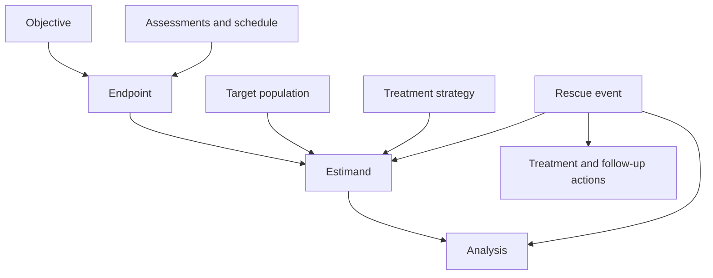

# Atopic dermatitis protocol builder and analyzer: design specification

Version 0.1 | 6 September 2026

**Recommendation: build a versioned model of the trial, then generate the protocol from it.** A document outline is one view of that model. The same model should generate the synopsis, treatment diagram, schedule of activities, endpoint table, and operational rules, and allow an analyzer to compare those views for consistency.

The recurring clinical question is: **which people receive which treatment strategy, along which possible paths, with which observations, to estimate which treatment effect, under which safety and operational rules?**

This specification supplies a common outline, semantic building blocks, input requirements, source crosswalk, and validation rules. The companion JSON Schema is an application design scaffold, not an implementation of ICH M11 or CDISC USDM and not a claim of regulatory conformance. The examples are partial, explicitly scoped extractions and synthetic validation cases, not complete protocols.

## Evidence coverage and its limits

I retrieved 17 public protocol or protocol/SAP PDF packages. Eleven representative files received detailed review of their contents structure and selected design, treatment, assessment, safety, or analysis sections; six companion files received structural checks. This was not an exhaustive line-by-line audit of every page or amendment.

The adult dupilumab phase 2 and SOLO protocol supplements could be identified but not retrieved. NEJM returned access restrictions and a human-verification challenge; the relevant ClinicalTrials.gov records did not expose protocol attachments. ClinicalTrials.gov and EU registry information were checked, including available amendment summaries, but their original section numbering is **not** asserted here. A separately identified adolescent phase 3 dupilumab protocol supplies an actual Regeneron structure. Lebrikizumab phase 2 is represented by its dose-ranging phase 2b study, not TREBLE.

| Requested program | Principal evidence | Review status and scope |
|---|---|---|
| Dupilumab phase 2 | R668-AD-1021, [NCT01859988](https://clinicaltrials.gov/study/NCT01859988); early phase 2 R668-AD-1117, [NCT01548404](https://clinicaltrials.gov/study/NCT01548404) | Registry design and endpoint definitions checked. Original protocols not retrieved. The early [NEJM supplement](https://www.nejm.org/doi/suppl/10.1056/NEJMoa1314768/suppl_file/nejmoa1314768_protocol.pdf) was inaccessible. |
| Dupilumab phase 3 | Adult [SOLO 1](https://clinicaltrials.gov/study/NCT02277743) / [SOLO 2](https://clinicaltrials.gov/study/NCT02277769); [adolescent protocol](https://cdn.clinicaltrials.gov/large-docs/28/NCT03054428/Prot_000.pdf), R668-AD-1526 amendment 3, approved 23 February 2018 | Adult registry evidence; adult [SOLO protocol supplement](https://www.nejm.org/doi/suppl/10.1056/NEJMoa1610020/suppl_file/nejmoa1610020_protocol.pdf) inaccessible. Adolescent protocol structure and key sections reviewed. These are different studies. |
| Lebrikizumab phase 2b | [DRM06-AD01 amendment 2](https://cdn.clinicaltrials.gov/large-docs/24/NCT03443024/Prot_000.pdf), NCT03443024, 7 March 2018 | Protocol reviewed; four-arm dose-ranging monotherapy example. |
| Lebrikizumab phase 3 | [ADvocate1](https://cdn.clinicaltrials.gov/large-docs/63/NCT04146363/Prot_000.pdf), DRM06-AD04 / J2T-DM-KGAB amendment 2, 20 May 2020; [ADvocate2](https://cdn.clinicaltrials.gov/large-docs/67/NCT04178967/Prot_000.pdf) | ADvocate1 detailed review; companion structure checked. |
| Adbry / tralokinumab | [ECZTRA 1](https://cdn.clinicaltrials.gov/large-docs/48/NCT03131648/Prot_000.pdf), LP0162-1325 v4, 14 August 2018; [ECZTRA 2](https://cdn.clinicaltrials.gov/large-docs/85/NCT03160885/Prot_001.pdf); [ECZTRA 3](https://cdn.clinicaltrials.gov/large-docs/54/NCT03363854/Prot_000.pdf) | ECZTRA 1 detailed review; ECZTRA 2/3 structure checked. |
| Nemluvio / nemolizumab | [ARCADIA 1](https://cdn.clinicaltrials.gov/large-docs/43/NCT03985943/Prot_000.pdf), RD.06.SPR.118161 v8, dated 4 November / approved 17 November 2021; [ARCADIA 2](https://cdn.clinicaltrials.gov/large-docs/49/NCT03989349/Prot_000.pdf) | ARCADIA 1 detailed review; companion structure checked. Some pages require visual reading; some content is redacted. |
| Risankizumab in AD | [M16-813 v5](https://cdn.clinicaltrials.gov/large-docs/40/NCT03706040/Prot_000.pdf), NCT03706040, registry document date 13 October 2020 | Protocol and embedded operations-manual structure reviewed. |
| Upadacitinib in AD | [Measure Up 1](https://cdn.clinicaltrials.gov/large-docs/93/NCT03569293/Prot_002.pdf), M16-045 v7, registry document date 13 December 2022; [Measure Up 2](https://cdn.clinicaltrials.gov/large-docs/22/NCT03607422/Prot_002.pdf); [AD Up](https://cdn.clinicaltrials.gov/large-docs/18/NCT03568318/Prot_000.pdf) | Measure Up 1 detailed review; companion structures checked. The posted Measure Up 1 PDF has 104 physical pages but refers to a 166-page document; treat it as incomplete for referenced material. |
| GSK IL-18 / GSK1070806 | [215253](https://cdn.clinicaltrials.gov/large-docs/38/NCT04975438/Prot_000.pdf), 6 June 2022; [219538 amendment 1](https://cdn.clinicaltrials.gov/large-docs/99/NCT05999799/Prot_002.pdf), 7 June 2024 | Both reviewed. The single-IV-dose study is **phase 1b**; the subsequent SC dose-ranging study is **phase 2b**. Dose information in the latter is partly redacted. |
| Temtokibart / LEO 138559 | [LP0145-1376 v4](https://cdn.clinicaltrials.gov/large-docs/21/NCT04922021/Prot_SAP_000.pdf), phase 2a, 31 January 2022; [LP0145-2240 v8](https://cdn.clinicaltrials.gov/large-docs/99/NCT05923099/Prot_SAP_000.pdf), phase 2b, 28 June 2024 | Both reviewed. Some phase 2b doses and instrument content are redacted. |

The machine-readable source inventory records exact URLs, file hashes, physical page counts, version information, and review scope. A file's upload date, approval date, amendment number, and internal document-system version are separate facts. Do not silently reconcile inconsistencies among them.

The adult dupilumab registry evidence also supports the versioning requirements. The [phase 2b EU amendment summary](https://www.clinicaltrialsregister.eu/ctr-search/trial/2012-003651-11/results) records changes to screening length, assessment timing, analysis populations, and transition into an extension. The [SOLO 1 EU amendment summary](https://www.clinicaltrialsregister.eu/ctr-search/trial/2014-001198-15/results) records changes to regional endpoint priority, rescue instructions, eligibility and analysis. These summaries establish change categories; they do not supply the original complete chapters.

## What the actual protocols establish

The same semantic components survive large changes in chapter numbering and grouping. Most differences are changes in where a component is printed, with important exceptions in the clinical rules themselves.

| Structure actually inspected | Objectives / endpoints | Design / population | Treatment / concomitant / rescue | Schedule / measurements | Safety reporting | Statistics | Governance |
|---|---|---|---|---|---|---|---|
| Dupilumab adolescent phase 3 | §§2, 8 | §§3, 4 | §5 | §6 | §7 | §9 | §§10–19 |
| Lebrikizumab phase 2b | §§2, 3 | §§4, 5 | §6 | §§7, 8; appendix 1 | §9 | §11 | §12 |
| Lebrikizumab ADvocate1 | §2 | §§3, 4 | §§5, 6 | §§7, 8; appendix 1 | §8.5 | §9 | §10 |
| Tralokinumab ECZTRA 1 | §6 | §§7, 8 | §9 | §§4, 10 | §11 | §12 | appendix 4 |
| Nemolizumab ARCADIA 1 | §7 | §§8.1–8.3 | §8.4 | §§8.1.2, 9 | §9.2.1 | §10 | §§11–13 |
| Risankizumab M16-813 | §3 | §§4, 5.1 | §§5.3–5.8 | appendix D; operations manual | §6 | §7 | §§8–11 |
| Upadacitinib Measure Up 1 v7 | §3 | §§4, 5.1 | §§5.3–5.8 | §5.10; appendix D | §6 | §7 | §§8–11 |
| GSK1070806 phase 1b / 2b | §3 | §§4, 5 | §6 | §§1.3, 8 | §8.4 | §9 | §10 |
| Temtokibart phase 2a | §6 | §§7, 8 | §9 | §§4, 11 | §13 | §14 | appendix 3 |
| Temtokibart phase 2b | §3 | §§4, 5 | §6 | §§1.3, 8 | §10 | §11 | §12 |

These references are source-native section numbers, not a suggested universal numbering scheme. The source links in the preceding table support this crosswalk. An analyzer that searches only for a chapter called “Endpoints” will miss the dupilumab placement under study variables. A chapter-level classifier must support many-to-many mappings.

Selected observations that materially shape the proposed model:

- **Regeneron phase 3:** objectives and endpoints appear in different chapters. Endpoint priority varies by jurisdiction. Weight-dependent dosing, placebo administrations, telephone contacts, and home administration cannot be represented by a single dose-frequency field. See R668-AD-1526 §§3, 5, 6, 8.
- **Lebrikizumab phase 2b:** amendment 2 corrects a laboratory/SoA mismatch and an omitted early-termination ECG. It also uses clinical considerations for sample size and no multiplicity adjustment for efficacy analyses. Those are explicit design choices, not missing alpha/power fields. See amendment 2 and §§11.1, 11.9.
- **Lebrikizumab phase 3:** prior treatment affects maintenance loading. The document includes induction, rerandomization, and escape pathways. A potential inconsistency is visible in §5.3.3: its EASI percentage parenthetical points in the opposite direction from the loss-of-response description in §3. Preserve and flag both assertions; do not silently repair the source. See PDF pages 36 and 42.
- **Tralokinumab:** the same primary outcomes are analyzed under different estimands. Systemic rescue can cause a temporary interruption with conditions for resumption. Background, rescue, and open-label treatment therefore require distinct policies. See §§9.7, 12.3.5.
- **Nemolizumab:** background topical therapy is adjusted according to response; it is distinct from rescue. Maintenance allocation depends on both initial assignment and response. The Q8W group receives intervening placebo administrations to preserve blinding. See §§8.1, 8.4.9.
- **Risankizumab:** eligibility and treatment rules sit together in an activities chapter; procedure details also live in an operations manual. Rescue rules refer to two successive visits, and sponsor blinding changes after the primary analysis while participant/site blinding continues. See §§4.1, 5.4, appendix F.
- **Upadacitinib:** drug interactions, laboratory thresholds, confirmation tests, interruption, recovery, and rechallenge require a substantial molecule-specific rule module. Study-drug discontinuation does not automatically mean study withdrawal. See M16-045 §§5.3, 5.6, 6.2.
- **GSK phase 1b:** biologic-naive and dupilumab-inadequate-response groups have different allocation ratios and endpoint roles. Cohort cannot be reduced to an arm label. See 215253 §4.1.
- **GSK phase 2b:** the primary analysis uses Bayesian estimation, with no primary hypothesis testing. Its primary estimand treats rescue, ordinary permanent discontinuation, and extreme operational disruption differently. One global “missing data” setting cannot represent this. See 219538 §§3.2.1, 9.1, 9.3.2.
- **Temtokibart phase 2a:** the primary outcome is absolute EASI change. Rescue and its consequences depend on timing, potency, and route; the primary estimand is hypothetical. See §§9.5, 14.3.8. “Before week 4” and “after week 4” wording also warrants an explicit boundary check.
- **Temtokibart phase 2b:** the primary outcome is percent EASI change and testing is hierarchical across dose regimens. The sponsor's own structure changed substantially between phase 2a and 2b. See §§3, 11.3.6. Sponsor name alone is therefore an insufficient template identifier.

## Standards positioning

Use [ICH M11](https://database.ich.org/sites/default/files/ICH_Step4_M11_Final_Template_2025_1119.pdf) as the external document-structure target. Its final template was adopted on 19 November 2025 and has an associated technical specification. [EMA's M11 page](https://www.ema.europa.eu/en/ich-m11-guideline-clinical-study-protocol-template-technical-specifications-scientific-guideline) distinguishes these documents. Pin their versions; do not treat following a similar outline as conformance.

Use [CDISC USDM / DDF](https://www.cdisc.org/ddf) as the interoperability reference for study definitions. Map the application's clinical entities to the chosen USDM release and separately map narrative sections to the chosen M11 release. These are complementary mappings. Neither substitutes for clinical reasoning or validates the trial design automatically.

Use the [ICH E9(R1) estimand framework](https://www.ema.europa.eu/en/documents/scientific-guideline/ich-e9-r1-addendum-estimands-and-sensitivity-analysis-clinical-trials-guideline-statistical-principles-clinical-trials-step-5_en.pdf) to keep the treatment question separate from the estimator. Represent treatment conditions, target population, outcome variable, intercurrent-event handling, and population summary explicitly. Missing measurements and intercurrent events are different concepts. A sensitivity analysis should address robustness for the same estimand; an analysis of a different treatment question is supplementary even if an older document labels it otherwise. Preserve the source's label alongside the normalized interpretation.

## A universal outline

The outline below is an original application-oriented synthesis of the corpus, arranged to map conveniently to M11. Its short labels are paraphrases. An actual M11 renderer must use the official template's exact structure and requirements.

| Section | Subsections to support | Underlying objects |
|---|---|---|
| 0. Identity and document control | Title and identifiers; sponsor and responsible roles; phase; protocol/approval dates; version and amendments; signatures; applicable regions; linked documents | Protocol version, role, amendment, source, dependency |
| 1. Study summary | Synopsis; treatment-path diagram; schedule of activities | Generated views of the same trial model |
| 2. Scientific justification | Disease and unmet need; mechanism; nonclinical/clinical evidence; trial purpose; benefits; risks and mitigation; overall justification | Evidence dossier, objective, risk, rationale |
| 3. Questions and outcomes | Repeated primary/secondary/exploratory objectives; corresponding endpoint definitions and estimands; region-specific priorities | Objective, endpoint, estimand, scope |
| 4. Design and participant paths | Trial type and control; cohorts; periods; allocation and rerandomization; entry/exit transitions; duration; design justification; interim decisions; whole-trial stopping; end-of-trial and subsequent access | Period, path, allocation, transition, decision |
| 5. Participant selection | Population rationale; inclusion/exclusion; prior-treatment definitions; washout; reproductive requirements; lifestyle rules; screen failures and rescreening | Population, eligibility expression, policy |
| 6. Treatments and concomitant care | Products and formulations; dose rationale; loading/maintenance; administration; masking; preparation/storage/accountability; adherence; dose changes; overdose; background/rescue/permitted/prohibited therapies | Product, regimen, administration, treatment policy |
| 7. Discontinuation and continued observation | Temporary interruption; permanent drug stop; restart/rechallenge; stopping one component of combination therapy; withdrawal from some/all procedures; consent withdrawal; lost contact; follow-up | State transition, rule, consent scope, event-triggered activity |
| 8. Assessments and procedures | Screening/baseline; efficacy; patient reports; clinical safety measurements; PK; PD/biomarkers; immunogenicity; specimens; optional studies; visit windows; sequence within visits | Assessment definition, encounter, scheduled activity, sample |
| 9. Safety events and reporting | AE/SAE/AESI definitions; disease-event exceptions; collection windows; grading/causality; reporting clocks and recipients; pregnancy; product complaints; special situations; outcome follow-up | Event definition, reporting rule, risk, responsibility |
| 10. Statistical specification | Analysis sets; endpoint/estimand-specific estimators; covariates; post-event data use; missing-data assumptions; sensitivity/supplementary analyses; testing families; Bayesian priors/decisions if used; interim analyses; sample-size rationale | Analysis, analysis set, testing family, sample-size design |
| 11. Oversight and conduct | Ethics and consent/assent; committees; monitoring; quality management; data governance; source records; privacy; deviations; site closure; insurance; publication and data sharing | Governance policy, role, dependency |
| 12. Supporting material | Laboratory panels; regional addenda; prior amendments; instruments and scoring references; operational detail; contingency arrangements | Appendix, overlay, referenced document |
| 13. Terminology | Defined terms and abbreviations | Controlled vocabulary plus source-native terminology |
| 14. References | Bibliography and linked supporting evidence | Evidence record |

The irreducible semantic content is more stable than its placement. For example, safety measurements and adverse-event reporting can share a chapter or be separate, but both meanings must be available. Not every assessment, committee, reproductive requirement, or biomarker module applies to every study. Record applicability and its reason, rather than filling every optional slot with generic prose.

## The core semantic building blocks

| Object | Smallest useful definition | Crucial distinction |
|---|---|---|
| Protocol version | Stable study identity + version + effective scope + source assertions | Approval date is not upload date; amendment history is not current operative text |
| Population | Clinical description + eligibility logic + applicable cohort/period | Enrolled population, estimand population, analysis set, and responder subset differ |
| Product | Active/placebo identity + formulation + concentration/strength + presentation | Molecular target does not determine formulation, storage, or safety requirements |
| Regimen | Ordered/repeating administrations + route + dose rules + start/stop anchors | Product, dose regimen, randomized arm, and entire treatment strategy differ |
| Trial path | Periods + treatment assignments + branching conditions | Follow-up duration need not equal time from randomization to last visit |
| Allocation | Eligible population + occasion + choices + ratio + strata + concealment | Initial randomization and rerandomization are separate operations |
| Assessment | Instrument/analyte + method/version + units + assessor + acquisition rules | Measuring EASI is not an EASI-75 endpoint |
| Scheduled activity | Assessment/action + encounter/anchor + timing/window + eligibility + order | A checked SoA cell can have a conditional footnote, not an unconditional action |
| Objective | Clinical question + importance/role + applicable region/period | One objective can have several endpoints or estimands |
| Endpoint | Measurements + transformation + time/window + response definition + eligible subset | Absolute change, percent change, and percent reduction have different semantics |
| Estimand | Treatment conditions + target population + variable + event strategies + summary | Endpoint name alone does not identify the treatment effect |
| Analysis | Estimand + analysis set + estimator + assumptions + data-handling rules | NRI is a data-handling method; it does not by itself define the whole estimand |
| Event/rule | Scope + trigger + modality + action + timing + exception + owner | Drug stop, study withdrawal, rescue use, and missing observation differ |
| Testing/decision family | Hypotheses or decisions + dependencies + error/prior framework | A Bayesian estimation study need not have a conventional alpha/power test |
| Governance/dependency | Responsible role + obligation + scope + authoritative document/version | A referenced operations manual may contain required content absent from the PDF |
| Evidence assertion | Field/value + source location + version + interpretation status | Unknown, redacted, unreported, inapplicable, inferred, and conflicting are different states |

A graph is a useful conceptual model; a relational database with stable IDs and link tables can implement it. A dedicated graph database is not a prerequisite.



This diagram shows one recurring dependency pattern. Event handling in an analysis and operational action after the event are separately specified relationships. Other intercurrent events use the same pattern.

## Grammar: document, meaning, and operational sentences

The document grammar should accept arbitrary sponsor headings and repeated blocks:

```ebnf
protocol_document = identity, summary, section*, appendix*, references ;
section           = heading, block*, section* ;
block             = narrative | list | definition | table | figure | rule | reference ;
section_mapping   = source_section, canonical_concept+ ;
```

The semantic grammar is stricter than the document grammar:

```ebnf
objective_bundle  = objective, (endpoint, estimand+, analysis+)+ ;
endpoint          = measurement+, transform, time_reference, aggregation,
                    [response_predicate], [eligible_subset] ;
estimand          = population, treatment_conditions, variable,
                    event_strategy*, population_summary ;
regimen           = administration+, [repeat_rule], [dose_condition*] ;
participant_path  = period+, allocation*, transition* ;
scheduled_action  = activity, time_reference, [window], [condition], [ordering] ;
rule              = scope, modality, trigger, action+, [exception*], owner ;
criterion         = predicate | all_of(criterion+) | any_of(criterion+)
                    | not(criterion) | temporally_qualified(criterion) ;
```

These are conceptual grammars. Detailed cardinalities are conditional: single-arm trials do not require randomization; exploratory objectives need not have fully elaborated estimands; no relevant intercurrent events must be an explicit assessed state.

Reusable sentence patterns should be generated from typed objects:

| Sentence function | Authoring grammar |
|---|---|
| Eligibility | `[Person/subgroup] must meet [predicate] at [time(s)], documented by [method], subject to [exception].` |
| Treatment | `[Eligible path] receives [dose and product] by [route] at [anchor/schedule], until [stop condition].` |
| Measurement | `[Assessor] performs [assessment/version] at [time/window], in [sequence], for [subset].` |
| Permission | `[Actor] may [action] when [condition], within [scope], unless [exception].` |
| Obligation | `If [trigger], [actor] must [action] within [interval from named event], and [follow-up action].` |
| Rationale | `[Choice] addresses [clinical/design problem], supported by [evidence], under [assumptions].` |
| Analysis | `[Estimand] is estimated in [analysis set] using [method]; [event-specific] and [missingness-specific] rules apply.` |

Preserve modal strength. “Should consider,” “may,” “must,” and “must not” are different. Capture negation, exceptions, conjunctions, temporal boundaries, unit systems, and the owner of a judgment. Investigator discretion is a legitimate typed input; a model must not invent a numeric threshold to replace it.

## Essential irreducible inputs

There is no defensible universal claim that a complete protocol needs exactly 20 or 30 scalar inputs. Arrays of arms, criteria, endpoints, visits, and rules make that number depend on the study. **The minimum is a set of decision packages, not a small form with molecule, indication, dose, N, and week.**

An input is irreducible if two materially different protocols remain possible after all other accepted inputs are fixed. For example, knowing the molecule, dose, population, endpoint and week does not determine whether rescued observations should contribute to the treatment effect.

| Decision package | Author must supply or explicitly accept | What becomes derivable |
|---|---|---|
| 1. Purpose and use | Development decision/claim; clinical question; exploratory versus confirmatory intent; jurisdictions | Candidate objective wording and relevant modules |
| 2. Population | Ages; diagnostic standard; severity definitions at specified times; prior treatment/failure criteria; cohorts; reproductive/lifestyle choices; all exclusions and exceptions | Eligibility text, screening checklist, cohort definitions |
| 3. Product and evidence | Current IB/nonclinical/clinical dossier; formulation, route, concentration/presentation; known/potential risks; stability/handling constraints; dose justification | Referenced scientific narrative and applicable product/safety content |
| 4. Treatments and paths | Comparator/background strategy; loading and maintenance doses; period durations; allocation ratios/strata; masking by role/time; rerandomization, escape, withdrawal and extension rules | Arm tables, participant diagram, dose calendar, masking administrations |
| 5. Other treatment rules | Washouts with anchors; permitted/prohibited drugs; background TCS/emollient rules; rescue triggers, escalation, stopping/restarting, and continued follow-up | Operational medication policy and linked intercurrent-event definitions |
| 6. Outcomes | Objective priorities; exact instruments/versions; transformations; primary time; responder thresholds; endpoint-specific eligible subsets; diary aggregation | Outcome tables, computations, measurement requirements |
| 7. Treatment effects | Population/contrast for each estimand; strategy for each relevant intercurrent event and reason; population summary | Estimand tables and constraints on data collection/analysis |
| 8. Analysis and evidence threshold | Analysis sets; estimator/covariates; missingness assumptions; multiplicity or explicit absence; priors/decision thresholds if used; sample-size basis and assumptions | A reproducible sample-size/power/precision calculation; statistical narrative |
| 9. Observation plan | Visit anchors/windows; assessment frequency; baseline definitions; within-visit order; remote/home activities; triggered assessments; optional subsets; sample volume/handling | SoA matrix, visit instructions, burden calculation |
| 10. Safety and stopping | AE/SAE/AESI collection/reporting scope; risk attribution windows; explicit triggers, confirmation, actions and restart criteria; committee authority; whole-trial stopping | Safety tables, reporting tasks, state transitions |
| 11. Conduct and data | Accountable roles; consent/assent; data/source-record policy; quality/monitoring requirements; retention/insurance/publication; external manual versions | Governance sections and operational dependencies |
| 12. Provenance and applicability | Protocol version; effective regional/site/cohort scope; inherited module versions; unresolved conflicts; rationale and reviewer acceptance for choices | Traceability, scoped variants, semantic amendment comparisons |

“Supply” includes selecting a reviewed, versioned library module. It does not mean manually retyping every sentence. Molecule-specific information cannot be inferred safely from an AD indication or target name alone. Site names and patient counts actually observed belong to execution/results data unless explicitly introduced as planning information.

Three useful completion states:

1. **Design-ready:** clinical question, population, treatment paths, outcome/estimand, and evidence strategy are coherent.
2. **Operationally specified:** schedules, interventions, rescue, safety, and continuing observations are executable by the responsible roles.
3. **Ready for formal review:** supporting documents and governance are resolved, applicable structural requirements pass, and unresolved clinical/statistical choices are explicit.

The tool should not describe a design-ready sketch as a complete protocol.

## The AD-specific module

Keep AD content in a module layered over the general model. Keep molecule and study choices outside that module's universal defaults.

| AD component | Fields that must remain explicit |
|---|---|
| Diagnosis and severity | Diagnostic standard/version; disease duration; EASI, IGA/vIGA-AD, BSA and itch thresholds; screening versus baseline evaluation; stable/inadequate treatment definitions |
| Clinician instruments | Instrument identity/version; score range; regional weighting where relevant; training; same-assessor preference; assessment order; permitted skin products before assessment |
| Patient reports | Exact item/instrument, respondent and language; recall period; daily capture time; collection and aggregation windows; valid-day minimum; rounding; missing-day rule |
| Topical background | Ingredient/product, potency classification and geography, body region, run-in, frequency, taper/stop/restart, adherence recording |
| Rescue | Permitted class/potency/route; timing; clinical trigger; escalation; exceptions; drug action; study/visit action; each estimand's treatment of the event |
| Response and maintenance | Entry response expression; whether rescue disqualifies; initial-treatment history; rerandomization ratio; loss-of-response duration/consecutive visits; escape and retreatment |
| Tissue and biomarkers | Blood/skin/tape-strip/swab procedure, subset/site eligibility, optional consent, sampling time and specimen processing |
| Mechanism-specific safety | Risk evidence and assessment/stopping rules selected for this drug and population; do not import another mechanism's package as a universal AD requirement |

Do not normalize all IGA instruments, all itch NRS instruments, or all topical potency classes into one undifferentiated term. Store both source-native identity and a reviewed mapping.

## A concrete endpoint and rescue example

This is a **synthetic illustration**, not an assertion that every reviewed study used the same rule.

For baseline EASI 32 and week-16 EASI 8:

- Absolute change: `8 - 32 = -24`.
- Percent change: `100 × (8 - 32) / 32 = -75%`.
- Percent reduction: `100 × (32 - 8) / 32 = 75%`.
- EASI-75 response: `percent_reduction >= 75`, which is true.

If that person used qualifying rescue at week 10, the observed week-16 measurement still exists. A composite response rule may classify the patient as a failure; a treatment-policy estimand may use the observed outcome; a hypothetical estimand requires an estimate for a specified world without the event. These are different questions, not alternate spellings of “missing.”

The implementation should therefore link:

`Rescue policy → rescue event → operational actions`

and, separately:

`Rescue event → strategy for estimand A/B → analysis data-handling rules`.

Changing rescue must trigger review of at least treatment instructions, participant transitions, scheduled observations, endpoint interpretation, estimands, analysis specifications, and the synopsis. The application should show that change impact automatically.

## Analyzer and builder architecture

1. **Ingest and classify source packages.** Detect protocol, amendment, synopsis, SAP, manual, registry, and publication. Retain study/version identifiers and physical page references. Distinguish inaccessible content, visible redactions, and failures of text extraction.
2. **Recover document structure.** Use bookmarks, numbering, heading typography and ToC as candidate evidence. Preserve tables, multi-level headers, figures, footnotes, appendices and references. A PDF can contain several documents; printed page numbers can restart. Bad bookmark destinations are not valid page evidence.
3. **Extract source assertions.** Create typed claims with field targets, source location, scope and status. Keep source wording available in the source system. Do not treat prior amendment descriptions, deleted text or publication summaries as current operative protocol instructions.
4. **Normalize semantics.** Resolve synonyms and units, parse conditions, link repeated concepts, and map to canonical objects. Keep the original terminology. Do not merge near-matching endpoints merely because they share EASI or week 16.
5. **Reconcile scope and version.** Apply an explicitly specified regional/cohort overlay; otherwise surface competing assertions. A later SAP is not automatically authorized to overwrite a protocol. Some dependencies require review rather than a universal precedence rule.
6. **Validate.** Run structural, numerical, temporal, cross-reference and semantic checks. LLMs can suggest interpretations and identify candidate disagreements. Deterministic checks should handle arithmetic, units, IDs, chronology and declared constraints. Clinical judgment remains an explicit unresolved/reviewed decision.
7. **Generate views.** Render sections, synopsis, treatment diagram, SoA and tables from accepted objects. Free narrative is allowed for rationale, but numerical and operational assertions must point back to the model.
8. **Compare and amend.** Diff values, scopes, conditions, formulas and paths. Produce amendment descriptions from accepted semantic changes and regenerate affected views.

A source assertion should record at least: document ID, version, section, physical PDF page, optional printed page/table/cell/bounding box, field target, extraction method, evidence state, normalization rationale, and review state. An opaque model confidence number alone is insufficient.

For authoring, distinguish **author-supplied**, **inherited**, **derived**, and **proposed** values. For analysis, distinguish **observed**, **redacted**, **not reported**, **not retrieved**, **not applicable**, and **conflicting** values. Missing dose text in a redacted source is not evidence that the study omitted dosing instructions.

## Validation requirements and evidence cases

The companion rule catalog specifies checks and their type. These are proposed product checks; no automated PDF-to-model extraction pipeline is claimed to have been implemented or benchmarked in this task.

| Check | What the analyzer should detect |
|---|---|
| Outcome completeness | Missing instrument, time, transformation, eligible subset where needed, or baseline definition |
| Outcome arithmetic | Percent change/reduction sign reversals; invalid denominators; impossible response thresholds |
| Cross-section consistency | Different thresholds, schedules, rescue policies or stopping conditions under the same scope/version |
| SoA completeness | An endpoint needs a baseline/follow-up measure that is not scheduled; a text-required ECG/lab has no activity |
| SoA footnotes | Subset, predose, optional, repeat or conditional actions lost when flattening a checked cell |
| Dose consistency | Loading plus maintenance double-counted; frequency conflicts; active/placebo injection patterns disclose assignment |
| Transition consistency | Missing responder/nonresponder branch, wrong prior-treatment eligibility, incompatible simultaneous destinations |
| Temporal boundaries | Day 0 versus day 1 shifts; ambiguous exact-week cutoffs; after-last-dose versus after-end-of-treatment confusion |
| Rescue consistency | Rescue changes drug disposition but has no follow-up rule, or affects analyses without a defined qualifying event |
| Estimand consistency | One global event strategy applied despite endpoint/estimand-specific rules; observed post-event data deleted when needed |
| Statistical completeness | Missing assumptions appropriate to the selected framework; alpha/power incorrectly demanded of non-testing estimation |
| Multiplicity/decisions | Broken ordering or cycles; undefined successful trial criteria; wrong regional primary-endpoint priority |
| Safety actions | Trigger lacks confirm/repeat/action/restart rule where required; units or scope differ; reporting clock lacks anchor/owner |
| Follow-up | Drug discontinuation incorrectly interpreted as consent withdrawal; safety observation ends earlier than its defined risk window |
| Version/applicability | Superseded amendment text treated as current; regional overlay applied globally; planned N replaced with actual enrollment |
| Evidence completeness | A referenced manual/SAP is absent, redacted or from another version; extraction failure mislabeled as an omission |

Useful real-document regression fixtures include the lebrikizumab phase 2b amendment corrections; the lebrikizumab maintenance EASI direction candidate; nemolizumab's placebo-interleaved maintenance schedule; GSK's mixed intercurrent-event strategies; temtokibart's absolute-versus-percent outcome change between phases; and upadacitinib's conditional toxicity actions. They should be manually adjudicated before being treated as a gold standard.

## Implementation boundaries and next build

The first useful product is a **source-traceable protocol model with linked rules and consistency checking**. A general prose generator is secondary.

The initial implementation should support AD parallel-group phase 2/3 trials, conditional maintenance/escape paths, both biologics and small molecules, and the analysis frameworks actually present here. Add crossover, cluster, platform, adaptive and other therapeutic-area modules through explicit extensions; these were not validated by this AD corpus.

Use representative files from different sponsor/version families for evaluation. Splitting near-identical companion studies between training and evaluation would overstate generalization. Measure field accuracy, exact preservation of thresholds/negation/units, timeline and branch correctness, evidence-location accuracy, conflict precision/recall, and coverage of required content. Do not report a percentage “protocol complete” without showing what content and dependencies remain unresolved.

A complete corpus validation still requires obtaining the original adult dupilumab phase 2 and SOLO supplements and adjudicating the public documents' redactions and referenced external materials. Their absence does not prevent the common model above, but it limits any claim that every requested original protocol has been read or that this schema has been proven universal.
